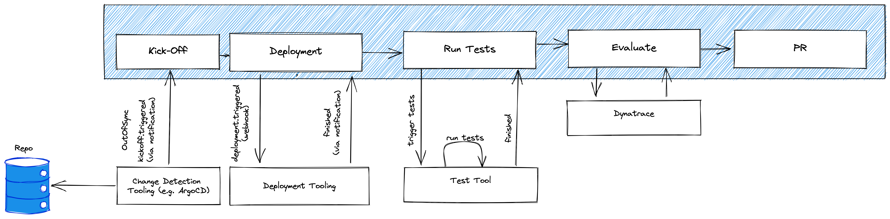

# ArgoCD Integration for Keptn

## Motivation
As many people use ArgoCD and could profit from the lifecycle orchestration features which keptn provide, the resources in this repo are intended to integrate ArgoCD in Keptn workflows.


Using ArgoCD as a deployment tool, you get a better overview about what's running and your system and how it differs from your desired state (git repo). Using Keptn as an orchestrator, you are able to integrate with testing tools, doing SLO-based evaluations and implement automatic remediation actions.

## The Idea
Currently, the integration is mainly based on notifications on the argo side and webhooks on the keptn side. Argo itself is used as a change detector in the git repository of its app. When a change is detected, it notifies Keptn about that and Keptn can trigger a deployment after an approval or automatically. After ArgoCD has finished its work, it sends a notification to Keptn and the further workflow can proceed.

## Pre-requisites
* Argo Notification Service (https://argocd-notifications.readthedocs.io/en/stable/)
* Keptn >=0.10 (Webhooks)

## This repository

```
- argo-config -> configuraton template for argocd
- keptn-config -> configuration template for keptn
- samples -> sample configurations for argocd apps
```

## Workflow (What / How it Happens)
1. Argo goes `OutOfSync` and triggers the `keptn-outofsync` notification. This is a `triggered` event for a delivery keptn sequence
2. Keptn webhook listens for a task event of `deliver.triggered` which sends a webhook to Argo `/sync`. The webhook will automatically generate the `deliver.started` task cloudevent because of this
3. When the app is synced and healty, Argo runs the `keptn-deployed` notification template which sends the `deliver.finished` task cloudevent to keptn
4. Keptn then progresses to the next task in the sequence (if there is one) eg. a load test or quality gate check

An minimal example Keptn shipyard file for this might be:

```
apiVersion: "spec.keptn.sh/0.2.2"
kind: "Shipyard"
metadata:
  name: "argocd-demo-shipyard"
spec:
  stages:
    - name: "dev"
      sequences:
        - name: "artifact-delivery"
          tasks:
            - name: "deliver"
            # (optional) your extra tasks here (eg. load tests, security scans, quality gates etc.)
            #- name: "load"
            #- name: "foo-task-here"
            #- name: "evaluation"
```

## Contributors

A big thanks to all [maintainers](CODEOWNERS) and [contributors](https://github.com/keptn-sandbox/keptn-argo-integration/graphs/contributors)!

## Contributing guidelines

Please refer to [Keptn contributing
guidelines](https://github.com/keptn/keptn/blob/master/CONTRIBUTING.md) for a
general overview of how to contribute to this repository with special attention
to our [bug first policy](https://github.com/keptn/keptn/blob/master/CONTRIBUTING.md#bug-first-policy)
